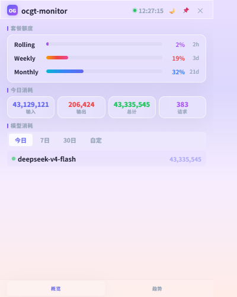

<div align="center">

# foundry-quota-sentinel

**OpenCode Go &amp; DeepSeek 多账户额度监控**

*Desktop sidebar for OpenCode Go quota &amp; DeepSeek token usage — multi-account, browser login.*

<p align="center">
  
  
  
  
  
</p>

<br>



<br><br>

**双击即用** &nbsp;&middot;&nbsp; 桌面侧边栏 &nbsp;&middot;&nbsp; 多账户卡片 &nbsp;&middot;&nbsp; 实时刷新

</div>

<br>

---

## 功能一览

<table>
<tr>
  <td width="50%"><strong>OpenCode Go 多账户</strong><br><span style="color:#5A5A7A;font-size:13px">同时展示所有账户的 Rolling / Weekly / Monthly 额度进度条，80%/95% 自动变色预警，单账户失效只影响该卡片</span></td>
  <td width="50%"><strong>DeepSeek 多账户</strong><br><span style="color:#5A5A7A;font-size:13px">余额 + 当月「按模型」每日 token 用量图（echarts 堆叠柱：命中缓存 / 未命中 / 输出）</span></td>
</tr>
<tr>
  <td><strong>浏览器登录</strong><br><span style="color:#5A5A7A;font-size:13px">弹窗登录自动抓取凭证：OpenCode 网页 Cookie、DeepSeek 网页 Token，免去手动 F12 复制</span></td>
  <td><strong>双主题</strong><br><span style="color:#5A5A7A;font-size:13px">亮色「灵动卡片」与暗色「深色专业」一键切换</span></td>
</tr>
<tr>
  <td><strong>自动刷新</strong><br><span style="color:#5A5A7A;font-size:13px">账户额度 2 秒轮询，DeepSeek 用量定时刷新</span></td>
  <td><strong>内置字体</strong><br><span style="color:#5A5A7A;font-size:13px">打包 UbuntuMono Nerd Font，渲染一致不依赖系统字体</span></td>
</tr>
</table>

## 快速开始

<div>
  <table>
  <tr>
    <td width="30" align="center" valign="top"><strong>1</strong></td>
    <td><strong>下载</strong><br><span style="color:#5A5A7A;font-size:13px">从 Releases 下载对应平台二进制，放入任意文件夹。</span></td>
  </tr>
  <tr>
    <td width="30" align="center" valign="top"><strong>2</strong></td>
    <td><strong>添加账户</strong><br><span style="color:#5A5A7A;font-size:13px">启动后点面板底部「添加账户」卡 → 选 OpenCode 或 DeepSeek → 弹窗登录即自动保存凭证。<br>也可命令行：<code>foundry-quota-sentinel login-deepseek &lt;名称&gt;</code> / <code>login-opencode &lt;名称&gt;</code>。</span></td>
  </tr>
  <tr>
    <td width="30" align="center" valign="top"><strong>3</strong></td>
    <td><strong>双击运行</strong><br><span style="color:#5A5A7A;font-size:13px">双击二进制，桌面侧边栏即刻启动，无需终端。</span></td>
  </tr>
  </table>
</div>

> **PowerShell 用户：** 运行命令时需加 `.\` 前缀，如 `.\foundry-quota-sentinel login-deepseek 我的号`

## 平台支持

| 平台 | GUI 形态 | OpenCode 浏览器登录 | DeepSeek 浏览器登录 | CLI / 网页面板 |
|---|---|---|---|---|
| Windows | 贴边自动隐藏的停靠侧边栏 | 用 `config add` 手动配置 | ✅ | ✅ |
| macOS | 普通独立窗口 | 用 `config add` 手动配置 | ✅ | ✅ |
| Linux | 普通独立窗口 | ✅ | ✅ | ✅ |

> OpenCode 的登录凭证是 httpOnly Cookie，自动抓取依赖系统 WebView 的 cookie store，目前实现于 Linux（WebKitGTK）；其它平台用 `config add` 手动填 Cookie / Workspace ID。DeepSeek 凭证为网页 Token，三平台均可弹窗自动抓取。停靠侧边栏的贴边自动隐藏是 Windows 原生能力。

## 从源码构建

构建依赖（CGO）：
- **Windows**：MinGW64（gcc）
- **macOS**：Xcode Command Line Tools
- **Linux**：`libgtk-3-dev libwebkit2gtk-4.0-dev`

```bash
# macOS / Linux 原生 GUI
go build -ldflags="-s -w" -o foundry-quota-sentinel .

# Windows GUI（见 build.bat）
build.bat

# 用 Docker 编 Linux GUI 二进制（容器内备齐 webkit 依赖）
./scripts/build-linux.sh

# 无原生 GUI 窗口、无 CGO 依赖（仍含 CLI 与 serve 网页面板，服务器/排错用）
CGO_ENABLED=0 go build -tags nogui -o foundry-quota-sentinel .
```

发行版二进制由 GitHub Actions 在三平台原生构建，推送 `v*` tag 时自动发布到 Releases。

## 使用模式

### 桌面侧边栏
半透明面板呈现一列账户卡片：所有 OpenCode Go 账户在上、所有 DeepSeek 账户在下、底部为「添加账户」卡。支持拖拽定位、固定、主题切换。

```bash
# 双击二进制直接启动，或在终端运行：
foundry-quota-sentinel serve --sidebar
```

### 网页面板
浏览器访问 `http://127.0.0.1:8788`，查看同款面板。

```bash
foundry-quota-sentinel serve
```

### 命令行
快速查询与凭证管理，适合脚本或远程终端。

| 命令 | 用途 |
|------|------|
| `quota` | OpenCode Go 套餐额度（活动账户） |
| `balance` | DeepSeek 余额（官方 API Key） |
| `history` | 本地 7 日 token 消耗历史 |
| `login-deepseek <名称>` | 弹窗登录 DeepSeek 保存网页 Token |
| `login-opencode <名称>` | 弹窗登录 OpenCode 保存 Cookie（Linux） |
| `config init` / `config add <名称>` | 交互式配置 / 添加账户 |
| `config list` / `config use <名称>` | 列出 / 切换账户 |

## 配置

配置存储在 `~/.foundry-quota-sentinel/config.json`（Windows 为 `%USERPROFILE%\.foundry-quota-sentinel\config.json`），每个用户独立。OpenCode 账户存于 `profiles`，DeepSeek 账户存于 `deepseek_accounts`。

环境变量优先级高于配置文件（仅影响 CLI 的活动账户查询）：

```bash
export OPENCODE_GO_AUTH_COOKIE='session=xxx; ...'
export OPENCODE_GO_WORKSPACE_ID='wrk_xxxxxxxxxxxx'
export DEEPSEEK_API_KEY='sk-xxxxxxxxxxxxxxxx'
```

## 项目结构

```
foundry-quota-sentinel/
  main.go                          CLI 入口与命令
  scripts/build-linux.sh           Docker 构建 Linux GUI 二进制
  internal/
    sidebar/sidebar_windows.go     Windows 停靠侧边栏（WebView2 + 自动隐藏）
    sidebar/sidebar_unix.go        macOS/Linux 独立窗口（WebKitGTK）
    sidebar/login_webview.go       DeepSeek 弹窗登录（扫存储抓 Token）
    sidebar/login_opencode_linux.go OpenCode 弹窗登录（读 cookie store, cgo）
    web/server.go                  HTTP 服务（/api/accounts、/api/deepseek 等）
    web/static/sidebar.html        面板 UI（双主题，内嵌 echarts/字体）
    quota/opencode.go              OpenCode Go 额度查询
    quota/deepseek_web.go          DeepSeek 网页接口（钱包 + 按天用量）
    config/config.go               配置管理
    storage/reader.go              本地日志读取与统计
```

## 技术栈

**Go 1.26+** · 系统 WebView（WebKitGTK / WKWebView / WebView2） · **echarts** · OpenCode Go RPC · DeepSeek 网页接口

---

<div align="center">
  <sub>Built with Go &middot; 系统 WebView &middot; echarts</sub>
</div>
