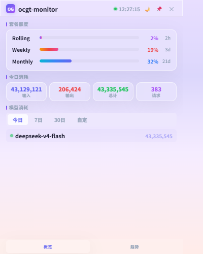

<div align="center">

# foundry-quota-sentinel

**多服务商 LLM 额度与用量监控**

<p align="center">
  
  
  
</p>

<br>



<br><br>

[**English**](README_EN.md) &nbsp;|&nbsp; **中文**

</div>

---

## 是什么

一个桌面侧边栏，统一监视以下服务商的额度与用量，支持多账户、浏览器自动登录抓取凭证。也提供命令行查询与本地网页面板。

支持的服务商：

- OpenCode Go
- CommandCode
- DeepSeek
- Ollama Cloud
- Kimi Code

## GUI

运行二进制即启动桌面侧边栏（Windows 贴边自动隐藏，macOS / Linux 独立窗口），或：

```bash
foundry-quota-sentinel serve --sidebar
```

浏览器访问 `http://127.0.0.1:8788` 打开网页面板。

添加账户：点面板底部「添加账户」→ 选择服务商 → 浏览器登录后自动保存凭证。也可以右键卡片打开该账户的官方用量页。

## CLI

| 命令 | 用途 |
|------|------|
| `quota` | OpenCode Go 套餐额度 |
| `balance` | DeepSeek 余额 |
| `history` | 本地 7 日 token 消耗历史 |
| `login-deepseek <名称>` | 弹窗登录 DeepSeek |
| `login-opencode <名称>` | 弹窗登录 OpenCode |
| `login-commandcode <名称>` | 弹窗登录 CommandCode |
| `login-ollama <名称>` | 一次性浏览器登录 Ollama |
| `login-kimi <名称>` | 一次性浏览器登录 Kimi Code |
| `quota-kimi [名称]` | 查询 Kimi Code 用量（默认查所有账户） |
| `open-page kimi <名称>` | 注入登录态打开 Kimi 会员额度页 |
| `config init` / `config add <名称>` | 交互式配置 / 添加账户 |
| `config list` / `config use <名称>` | 列出 / 切换账户 |

## 架构与核心 SDK

本项目采用分层解耦架构：
- **`pkg/sdk/`（核心 SDK 库）**：纯 Go、零 Cgo 依赖，提供 OpenCode、DeepSeek、Kimi、CommandCode、Ollama 原生配额获取、CDP 浏览器凭据拦截（`pkg/sdk/auth`）与跨进程并发文件锁存储（`pkg/sdk/store`）。
- **展示客户端**：基于 `pkg/sdk` 构建的 CLI 终端界面（`main.go`、`cmd_*.go`）、本地 Web 服务（`internal/web/`）与桌面 GUI 侧边栏（`internal/sidebar/`）。

## 构建

```bash
# GUI（需 CGO + 系统 webkit2gtk / WKWebView / WebView2）
go build -ldflags="-s -w" -o foundry-quota-sentinel .
./scripts/build-linux.sh            # Docker 编 Linux GUI 二进制

# CLI / 无 GUI（纯 Go 静态，含 serve 网页面板）
go build -tags nogui -o foundry-quota-sentinel .
```

配置存储在 `~/.foundry-quota-sentinel/config.json`（Windows 为 `%USERPROFILE%\.foundry-quota-sentinel\`）。

---

<div align="center">
  <sub>Built with Go &middot; system WebView &middot; echarts</sub>
</div>